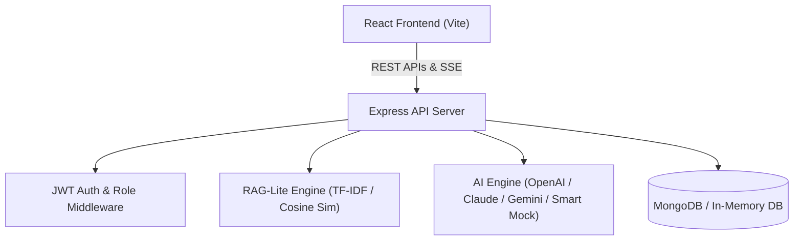

# High-Level Design (HLD) - PrepMate

## 1. System Architecture Overview

PrepMate follows a modern client-server architecture built on the MERN stack (MongoDB, Express, React, Node.js), enhanced with RAG-lite vector processing and Server-Sent Events (SSE) for real-time interaction.

---

## 2. Component Architecture & Responsibilities

### 2.1 Frontend Layer (`/client`)
- **Technology**: React 18, React Router v6, Vite, Custom CSS Design System.
- **State & Routing**: AuthContext for authentication state; ProtectedRoute & AdminRoute guards.
- **Key Modules**:
  - `ResumeUpload`: PDF upload and skill preview.
  - `QuestionGen`: RAG analysis triggering and question generation.
  - `MockInterview`: Interactive SSE streaming mock interview room.
  - `SessionDetail`: Visual performance report dashboard.
  - `AdminDashboard`: Platform analytics and metrics monitoring.

### 2.2 API Server Layer (`/server`)
- **Technology**: Node.js, Express.js.
- **Key Middleware**:
  - `auth.middleware.js`: Verifies bearer JWT tokens.
  - `role.middleware.js`: Enforces admin privileges (`requireAdmin`).
  - `rateLimiter.js`: Protects AI & Auth endpoints from abuse (`express-rate-limit`).
  - `error.middleware.js`: Centralized error logging and JSON responses.
  - `upload.middleware.js`: Handles PDF upload buffers via Multer.

### 2.3 RAG & AI Processing Engine (`/server/src/utils`)
- `pdfParser.js`: Extracts raw textual content from uploaded PDF resumes using `pdf-parse`.
- `ragSkillsExtractor.js`: Extracts technical skills (including JS Core: Event Loop, Hoisting; Database: Relational Schema PK/FK, SQL JOINs; AI Architecture: LLM Eval Sets, RAG Vector Retrieval, Multi-Step Agents), computes TF-IDF representations, and calculates cosine similarity against job descriptions to identify skill gaps.
- `aiService.js`: Multi-provider engine (OpenAI, Anthropic Claude, Google Gemini, Smart Mock) handling question generation, SSE streaming responses, and final interview evaluations.

### 2.4 Data Persistence Layer (`/server/src/config/db.js`)
- Mongoose ODM connecting to primary MongoDB database.
- Automatic fallback to `mongodb-memory-server` if local/remote MongoDB instance is unavailable.

---

## 3. Key Data Flows

### 3.1 RAG Question Generation Flow
1. Candidate uploads PDF resume & submits target job description text.
2. `pdfParser` extracts clean text from PDF buffer.
3. `ragSkillsExtractor` extracts taxonomy skills, builds TF-IDF vectors, computes cosine similarity, and isolates missing/overlapping skills.
4. `aiService` constructs a prompt with candidates' skill gap profile and generates 8-10 customized questions.
5. Interview session record is saved in MongoDB with status `created`.

### 3.2 Live SSE Streaming Interview Flow
1. Candidate sends candidate response to `/api/interviews/:sessionId/answer-stream`.
2. Server opens SSE connection (`Content-Type: text/event-stream`).
3. `aiService` generates real-time token feedback & follow-up questions, streaming chunks to the client.
4. Client renders text token-by-token.
5. On completion, transcript turn and token usage metrics are persisted to the database session record.

---

## 4. Security & Quality Architecture
- **Authentication**: JWT signed with secret, set to expire in configurable window (`JWT_EXPIRES_IN`).
- **Authorization**: Role-based access control preventing regular users from accessing `/api/admin/*`.
- **Rate Limiting**: AI & Auth routes limited to prevent API key exhaustion and DDoS.
- **Validation**: Joi schema validation on incoming request bodies (`validators.js`).
